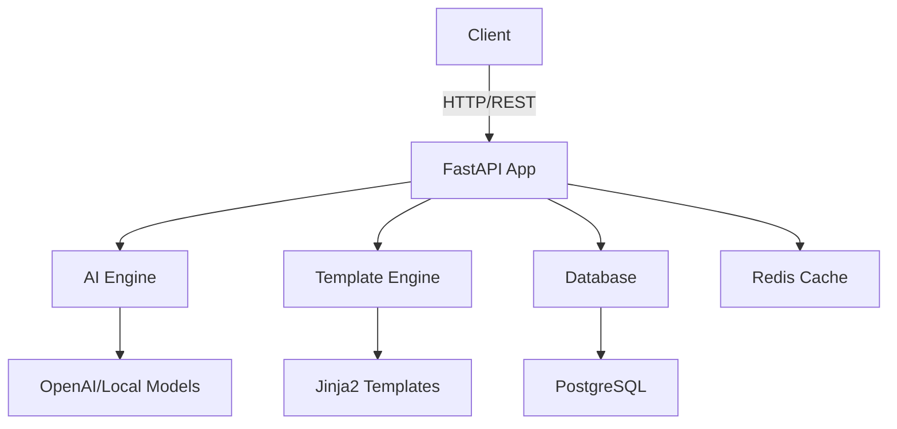

# Aoede Technical Documentation

## Overview

Aoede is a FastAPI-based open-source website generation engine that uses AI to create modern, responsive websites. This documentation covers technical aspects, implementation details, and usage guidelines.

## Architecture



## Core Components

### FastAPI Application
- Async request handling
- OpenAPI documentation
- Dependency injection
- Middleware configuration

### AI Engine
- Model integration
- Prompt engineering
- Content generation
- Error correction

### Template System
- Base templates
- Component library
- Style generation
- HTML/CSS output

## Getting Started

1. [Installation Guide](./installation/README.md)
2. [Configuration](./configuration/README.md)
3. [API Reference](./api-reference/README.md)
4. [Development Guide](./development/README.md)

## Python Requirements

```text
fastapi>=0.95.0
uvicorn>=0.21.0
sqlalchemy>=2.0.0
alembic>=1.10.0
redis>=4.5.0
pydantic>=2.0.0
python-jose>=3.3.0
passlib>=1.7.4
```

## Development

### Virtual Environment Setup
```bash
python -m venv venv
source venv/bin/activate
pip install -r requirements.txt
pip install -r requirements-dev.txt
```

### Running Tests
```bash
pytest --cov=app tests/
```

### Code Quality
```bash
# Format code
black .

# Sort imports
isort .

# Type checking
mypy .

# Linting
flake8
```

## API Documentation

Explore our [API Reference](./api-reference/README.md) for detailed endpoint documentation.

### Quick Example

```python
from fastapi import FastAPI, Depends
from app.core import get_current_user
from app.schemas import WebsiteRequest

app = FastAPI()

@app.post("/generate")
async def generate_website(
    request: WebsiteRequest,
    current_user = Depends(get_current_user)
):
    # Implementation
    pass
```

## Contributing

See our [Contributing Guide](../CONTRIBUTING.md) for:
- Code style guide
- Pull request process
- Development workflow
- Testing requirements

## Support

- [GitHub Issues](https://github.com/canopus-development/Aoede/issues)
- [Discord Community](https://discord.gg/JUhv27kzcJ)
- Email: support@canopus.software
