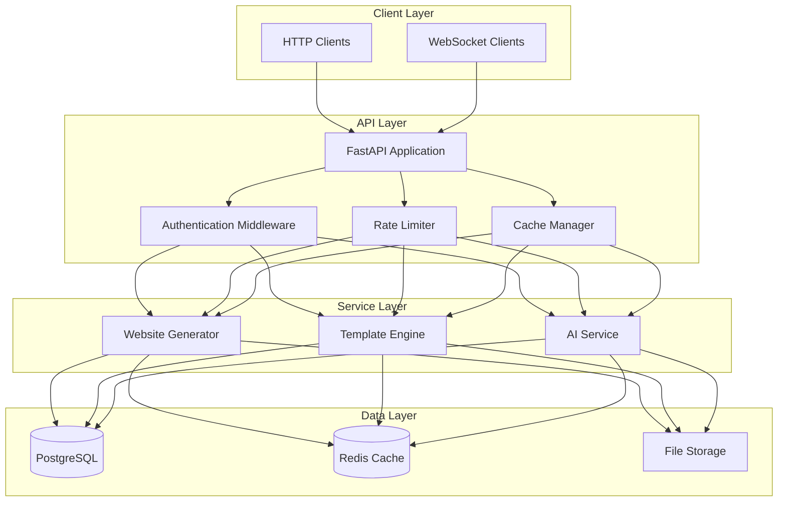
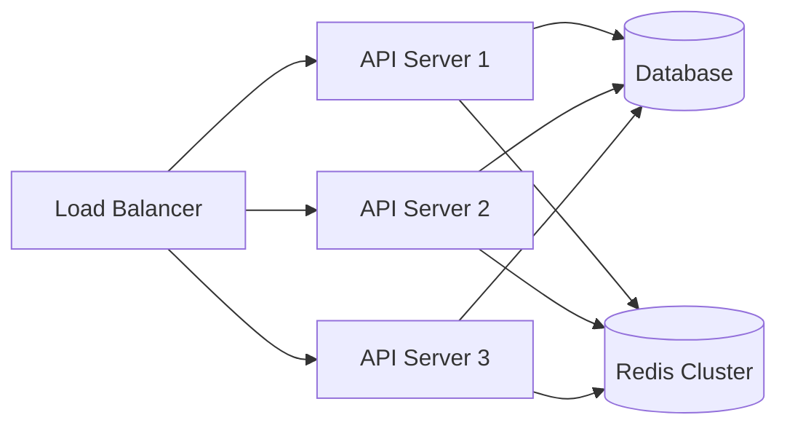

# Aeodos Architecture

## System Overview

Aeodos is built on a modern, scalable architecture that combines FastAPI's high performance with AI-powered generation capabilities.



## Core Components

### 1. API Layer

#### FastAPI Application
- Asynchronous request handling
- Automatic OpenAPI documentation
- Type validation with Pydantic
- Dependency injection system

```python
from fastapi import FastAPI, Depends
from app.core.auth import get_current_user
from app.core.rate_limit import rate_limiter

app = FastAPI(
    title="Aeodos API",
    description="AI-Powered Website Generation Engine",
    version="1.0.0"
)

@app.post("/generate")
@rate_limiter(max_requests=50, window_seconds=3600)
async def generate_website(
    request: WebsiteRequest,
    user: User = Depends(get_current_user)
):
    # Implementation
```

### 2. Service Layer

#### Website Generator
- Handles website generation pipeline
- Manages generation tasks
- Coordinates between AI and template services

#### Template Engine
- Base template management
- Component library
- Style system
- HTML/CSS generation

#### AI Service
- Model integration
- Content generation
- Error correction
- Content optimization

### 3. Data Layer

#### Database Schema
```sql
-- Users table
CREATE TABLE users (
    id UUID PRIMARY KEY,
    email VARCHAR(255) UNIQUE NOT NULL,
    api_key_hash VARCHAR(255),
    created_at TIMESTAMP WITH TIME ZONE DEFAULT NOW()
);

-- Projects table
CREATE TABLE projects (
    id UUID PRIMARY KEY,
    user_id UUID REFERENCES users(id),
    status VARCHAR(50),
    config JSONB,
    created_at TIMESTAMP WITH TIME ZONE DEFAULT NOW()
);
```

#### Redis Cache Structure
```python
# Cache keys structure
f"user:{user_id}:rate_limit"     # Rate limiting data
f"project:{project_id}:status"    # Project status
f"template:{template_id}:data"    # Template cache
```

## Security Architecture

### Authentication Flow
1. API key generation and hashing
2. Request authentication
3. Rate limiting
4. Permission validation

```python
class SecurityConfig:
    ALGORITHM = "HS256"
    API_KEY_LENGTH = 32
    RATE_LIMIT_WINDOW = 3600
    MAX_REQUESTS_PER_HOUR = 50
```

### Data Protection
- TLS 1.3 encryption
- API key hashing with Argon2
- SQL injection prevention
- XSS protection
- CORS configuration

## Performance Optimization

### Caching Strategy
1. Redis for high-speed data caching
2. Template caching
3. Generated asset caching
4. Rate limit tracking

### Async Processing
- Asynchronous request handling
- Background task processing
- WebSocket status updates
- Queue management

## Scaling Considerations

### Horizontal Scaling


### Resource Management
- Database connection pooling
- Redis connection pooling
- Background worker scaling
- File storage optimization

## Monitoring and Logging

### Metrics Collection
- Request latency
- Generation success rate
- Resource usage
- Error rates

### Logging System
```python
class LogConfig:
    LOGGER_NAME = "aeodos"
    LOG_FORMAT = "%(asctime)s - %(name)s - %(levelname)s - %(message)s"
    LOG_LEVEL = "INFO"

    # Example configuration dict
    config = {
        "version": 1,
        "disable_existing_loggers": False,
        "formatters": {
            "default": {
                "format": LOG_FORMAT,
                "datefmt": "%Y-%m-%d %H:%M:%S",
            },
        },
        "handlers": {
            "default": {
                "formatter": "default",
                "class": "logging.StreamHandler",
                "stream": "ext://sys.stdout",
            },
        },
        "loggers": {
            "aeodos": {"handlers": ["default"], "level": LOG_LEVEL},
        },
    }
```

## Error Handling

### Error Categories
1. Client Errors (4xx)
2. Server Errors (5xx)
3. Generation Errors
4. Integration Errors

### Error Response Format
```json
{
    "error": true,
    "code": "ERROR_CODE",
    "message": "Human-readable error message",
    "details": {
        "field": "Additional context"
    },
    "timestamp": "2024-01-20T12:00:00Z",
    "request_id": "req_abc123"
}
```

## Further Reading

- [API Reference](../api-reference/README.md)
- [Development Guide](../development/README.md)
- [Deployment Guide](../deployment/README.md)
- [Security Guide](../security/README.md)
